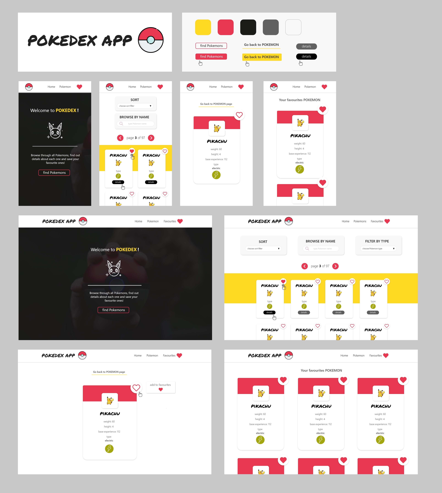

### Pokedex-app [React]

App that stores basic info about Pokemon & allow adding chosen ones to Favourites.

App make use of:

* RESTful Pokémon API
* React Hooks
* Context API
* React Router v.4
* localStorage
* PWA
* custom styling (flexbox)

#### Designed in AdobeXD

#### App [demo](https://pokedex-pokeapi.netlify.com/)

#### App functionalities

1. Browse through Pokemon using pagination.

2. Filter Pokemon based on Pokemon name/type.

3. Sort Pokemon based on chosen filter.

4. Add Pokemon to/remove from Favourites.

5. Get chosen Pokemon detail info.

6. Persist favorites Pokemon irrespective of browser tab closing / refreshing.

#### For developers [setup instructions];

1. Clone or download the repository.

2. Cd into project directory.

3. Install project dependencies with `npm install` or `yarn`.

4. Run `npm start` or `yarn start` to spin up the development server. Open app in the browser on `http://localhost:3000`.

#### Dependencies

* project was bootstrapped with [Create React App](https://github.com/facebook/create-react-app)
* pokemon data from [PokéAPI](https://pokeapi.co/)
* build & deployment by [Netlify](https://www.netlify.com/)
* designed with [AdobeXD](https://www.adobe.com/pl/products/xd.html)
* layout made with [Flexbox Layout](https://css-tricks.com/snippets/css/a-guide-to-flexbox/)
* hero image from [Pexels](https://www.pexels.com/)
* icons by [Flaticon Premium](https://www.flaticon.com/home)

